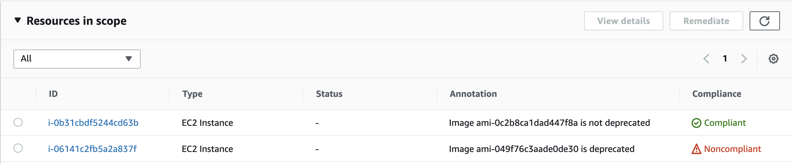

# EC2 Deprecated AMI Config Rule

This repo provides a Lambda function for scanning your AWS accounts for deprecated, deleted, and unshared AMIs.

AWS added a new feature to EC2 which allows you to define a deprecationTime to AMIs. After this time is reached, existing instances and launch templates can be used but new ones cannot be created with the deprecated AMIs.

This config rule exists to detect any running instances that are using deprecated AMIs and autoscaling groups that are using a launch template with a deprecated AMI. This will also detect AMIs that are not available either due to AMI deregistry or unsharing.



## How to use

To deploy this Lambda, you should follow the [blog post here](https://aws.amazon.com/blogs/mt/aws-config-rule-development-kit-library-build-and-operate-rules-at-scale/) to install the rdklib AWS Lambda layer.

Please note that older versions of the rdklib layer may not have the correct version of dependencies. Ensure you are using the latest version of it.

Once this is done, you can deploy by running:

```sh
rdk init # if you have not already
rdk deploy AMI_DEPRECATED_CHECK --rdklib-layer-arn YOUR_RDKLIB_LAYER_ARN
```

## Future Additions
This module can be enhanced in the future to detect other various uses of AMIs beyond EC2.
